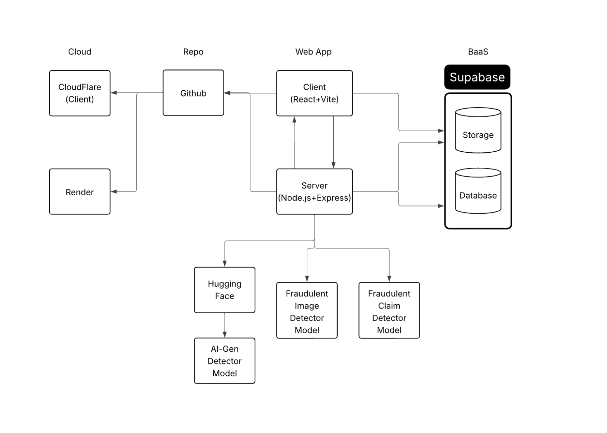

# iSpy - AI Vehicle Damage Claim Fraud Detection

A comprehensive AI-powered system for detecting fraudulent vehicle damage claims through advanced machine learning and intelligent document analysis.

## 🏗️ System Architecture



*Complete system architecture showing component relationships and data flow*

## 📚 Documentation

### Frontend Documentation
- **[Frontend README](./frontend/README.md)** - Complete frontend architecture, component relationships, and development guide
- **Technologies**: React 19, TypeScript, Vite, Tailwind CSS, Supabase
- **Features**: AI-powered analysis interface, real-time dashboard, case management

### Backend Documentation
- **[Backend README](./backend/README.md)** - Backend services and API documentation
- **Technologies**: Node.js, Express, ML models, Supabase integration
- **Features**: Document processing, fraud detection API, data management

### Machine Learning Documentation
- **[ML README](./backend/ml/README.md)** - Machine learning models and training documentation
- **Models**: Custom CNN, EfficientNet, ResNet, Vision Transformer, Ensemble
- **Features**: Fraud detection, risk assessment, explainable AI

## 🚀 Quick Start

### Prerequisites
- Node.js (v18 or higher)
- npm or yarn package manager
- Supabase account and project setup
- Python 3.8+ (for ML backend)

### Installation

1. **Clone the repository**
   ```bash
   git clone <repository-url>
   cd ispy
   ```

2. **Install frontend dependencies**
   ```bash
   cd frontend
   npm install
   ```

3. **Install backend dependencies**
   ```bash
   cd ../backend
   npm install
   ```

4. **Install ML dependencies**
   ```bash
   cd ml
   pip install -r requirements.txt
   ```

### Development Setup

1. **Start the ML backend**
   ```bash
   cd backend/ml
   python main.py
   ```

2. **Start the Node.js backend**
   ```bash
   cd backend
   npm start
   ```

3. **Start the frontend development server**
   ```bash
   cd frontend
   npm run dev
   ```

## 🔧 Environment Configuration

Create environment files for each component:

### Frontend (.env)
```env
VITE_PUBLIC_SUPABASE_URL=your_supabase_url
VITE_PUBLIC_SUPABASE_ANON_KEY=your_supabase_anon_key
VITE_STORAGE_NAME=your_storage_bucket_name
VITE_UPLOAD_FOLDER=uploads
VITE_FRAUD_FOLDER=fraud
VITE_NON_FRAUD_FOLDER=non-fraud
VITE_API_URL=your_ml_api_url
```

### Backend (.env)
```env
SUPABASE_URL=your_supabase_url
SUPABASE_ANON_KEY=your_supabase_anon_key
ML_API_URL=your_ml_api_url
```

## 🎯 Key Features

### 🤖 AI-Powered Fraud Detection
- Advanced machine learning models for fraud detection
- Real-time image analysis and risk assessment
- Explainable AI with detailed analysis reports

### 📊 Comprehensive Dashboard
- Interactive analytics and trend visualization
- Real-time statistics and monitoring
- Alert system for high-risk cases

### 📁 Intelligent Document Processing
- Multi-format document support (PDF, images)
- Batch processing with progress tracking
- Automated fraud detection workflow

### 🔍 Case Management
- Advanced search and filtering capabilities
- Detailed case analysis and reporting
- Cost tracking and ROI analysis

## 🏛️ System Architecture

The iSpy system consists of three main components:

```
┌─────────────────┐    ┌─────────────────┐    ┌─────────────────┐
│   Frontend      │    │   Backend       │    │   ML Engine     │
│   (React)       │◄──►│   (Node.js)     │◄──►│   (Python)      │
│                 │    │                 │    │                 │
│ • Dashboard     │    │ • API Gateway   │    │ • CNN Models    │
│ • Upload UI     │    │ • File Storage  │    │ • Ensemble      │
│ • Case Mgmt     │    │ • Data Mgmt     │    │ • Analysis     │
└─────────────────┘    └─────────────────┘    └─────────────────┘
         │                       │                       │
         └───────────────────────┼───────────────────────┘
                                 │
                    ┌─────────────────┐
                    │   Supabase      │
                    │   (Database)    │
                    │                 │
                    │ • PostgreSQL    │
                    │ • Storage       │
                    │ • Real-time     │
                    └─────────────────┘
```

## 🛠️ Technology Stack

### Frontend
- **React 19** - Modern React with latest features
- **TypeScript** - Type-safe development
- **Vite** - Fast build tool and development server
- **Tailwind CSS** - Utility-first CSS framework
- **Chart.js** - Data visualization
- **Supabase** - Backend-as-a-Service integration

### Backend
- **Node.js** - JavaScript runtime
- **Express** - Web application framework
- **Supabase** - Database and storage
- **Axios** - HTTP client for API calls

### Machine Learning
- **Python 3.8+** - ML development environment
- **PyTorch** - Deep learning framework
- **scikit-learn** - Machine learning library
- **OpenCV** - Computer vision
- **PIL/Pillow** - Image processing

## 📈 Performance & Scalability

- **Real-time Processing** - Instant fraud detection results
- **Batch Processing** - Efficient handling of multiple files
- **Scalable Architecture** - Cloud-ready deployment
- **Optimized Models** - Fast inference with high accuracy

## 🔐 Security & Compliance

- **Data Protection** - Secure file handling and storage
- **Privacy Compliance** - GDPR-ready data processing
- **Secure APIs** - Protected endpoints and authentication
- **Audit Trail** - Complete analysis history tracking

## 🚀 Deployment

### Production Build
```bash
# Frontend
cd frontend
npm run build

# Backend
cd backend
npm run build
```

### Docker Deployment
```bash
docker-compose up -d
```

### Cloud Deployment
- **Frontend**: Deploy to Vercel, Netlify, or AWS S3
- **Backend**: Deploy to Heroku, AWS EC2, or Google Cloud
- **ML Engine**: Deploy to AWS SageMaker or Google AI Platform

## 📊 Monitoring & Analytics

- **Real-time Dashboard** - Live system monitoring
- **Performance Metrics** - Response times and accuracy
- **Cost Analysis** - ROI tracking and optimization
- **Fraud Detection Rates** - Success metrics and trends

## 🤝 Contributing

1. Fork the repository
2. Create a feature branch
3. Make your changes
4. Add tests if applicable
5. Submit a pull request

## 📄 License

This project is licensed under the MIT License - see the LICENSE file for details.

## 📞 Support

For questions, issues, or contributions:
- Create an issue in the repository
- Contact the development team
- Check the documentation for troubleshooting

---

**iSpy** - Intelligent fraud detection for the modern insurance industry.